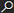

# Payroll journal entries

When you post a payroll run, OnePayroll creates General Journal Lines based on payroll entries and user-configured GL accounts. This article explains how journal lines are created, consolidated, and posted.

## When General Journal Lines are created

General Journal Lines are created when you choose the **Post** action on a payroll run — not during creation or approval. The behavior depends on the **General Ledger Posting** setting in Payroll Setup:

| Setting | General Journal Lines created? | Automatically posted? |
|---|---|---|
| No Transfer | No | N/A |
| Manual Posting | Yes | No — you must post manually |
| Automatic Posting | Yes | Yes |
| Always Ask | Yes | You choose each time |

## How journal lines are generated

### 1. Buffering

All payroll entries for the payroll run are collected. Each entry's GL account (Account No.), balance account (Balance Account No.), date, amount, and dimension set are recorded into a posting buffer.

### 2. Line creation

From the buffer, General Journal Lines are created in the journal template and batch configured on the **pay group**:

- One line for the **Account No.** with the entry amount
- One line for the **Balance Account No.** with the inverse amount (if a balance account is specified)

Each line includes:
- **Document No.** — Formatted using the **G/L Document No. Format** from Payroll Setup (with placeholders replaced from the payroll run)
- **Description** — Formatted using the **G/L Description Format** from Payroll Setup
- **Source Code** — Set from the **SwS Payroll** source code in Source Code Setup (if configured)
- **Reason Code** — Inherited from the journal batch
- **Posting Date** and **Document Date** — Set to the entry date
- **Dimension Set ID** — Carried from the payroll entry dimensions

### 3. Consolidation

After initial creation, journal lines are consolidated:

- Lines with the **same Account No. and same Dimension Set ID** are combined into a single line with the summed amount
- Lines with a **zero amount** after consolidation are removed

This means a payroll with 50 employees posting to the same salary expense account (with the same dimensions) results in a single consolidated journal line for that account.

### 4. Posting

- **Manual Posting**: The journal lines remain in the General Journal for you to review and post
- **Automatic Posting**: The standard BC **Gen. Jnl.-Post** codeunit runs immediately to post the lines  
- **Always Ask**: The posting confirmation dialog is shown; if confirmed, lines are posted

## Reviewing journal lines

### Before posting (Manual Posting mode)

If using Manual Posting, review the lines in the General Journal:

1. Open the **General Journal**
2. Select the journal template and batch configured on the pay group
3. Review each line:
   - **Account No.** — Correct GL account?
   - **Amount** — Expected consolidated amount?
   - **Posting Date** — Correct period?
   - **Dimension Set ID** — Correct dimensions?
4. Post the journal when satisfied

### After posting

To review posted entries:

1. In **Payroll Runs**, select the posted payroll run
2. Choose the **General Ledger Log** action

Or choose the  icon, enter **General Ledger Entries**, and then choose the related link, and filter by document number and posting date.

## Journal batch requirements

Before posting, OnePayroll checks that the configured journal batch is empty (no existing unposted lines with non-zero amounts). If unposted lines exist, an error is raised with a **Show Journal** action that lets you navigate directly to the journal to resolve the issue.

This prevents accidentally mixing payroll entries from different runs in the same journal batch.

## Troubleshooting

### "Unposted general journal lines" error

The journal batch still has lines from a previous payroll posting. Open the journal (use the link in the error) and either post or delete the existing lines before retrying.

### Journal lines don't appear

- Verify **General Ledger Posting** is not set to **No Transfer**
- Confirm the pay group has **Gen. Journal Template** and **Gen. Journal Batch** configured
- Check that pay types have GL accounts assigned (Account No.)

### Amounts don't match expected totals

- Remember that lines are consolidated by Account No. and Dimension Set ID
- If different employees have different dimensions, their entries won't be consolidated together
- Check if any pay types are missing GL account assignments

## Related information

- [Set up GL posting for payroll](gl-posting-setup.md)
- [Configure payroll settings](payroll-setup.md)
- [Process payroll runs](payroll-runs-process.md)
- [GL integration overview](gl-integration-overview.md)
